## Pittsburgh to DC as fast as possible: A How To

# Required Warnings

This is not fun. I think in general anyone who does this understands that while parts will be fun in pieces, in general this is a competition to see how much you can endure both physically and mentally. Its easy to shrug off text on a page, but this is a significant trip. I think its a great place to start. As someone with lots of centuries and a taste for pushing personal limits its a perfect first ultra-like event. Its generally flat, it has impressive miles, you're off the road the entire way and there are ample places to stop and adjust if you need. You can stop at bike shops along the way (assuming they're open) and there are 24 hour gas stations and such that you can get to within a reasonable amount of time from the trail. There is also tons of water along the way so you can safely assume you'll have access. This does not mean you can just rock a single water bottle and manage, but it does mean you dont need to pack in 10L of water. All these factors made this a tempting goal to me, I'm on the inexperienced side of things when it comes to super super long rides, but I did it by reading a bunch and trying to find as many helpful tips as possible. I'm hoping arranging all of that info here will assist the next person and really open up the trip to more people.

# History Lesson

Upon my writing of this, I'm seemingly the 8th person to do the trip. Here is what I could find:

1. 24h19m       Tandem Supported    ->  Seth and Rebecca            |   https://bikepgh.org/message-board/topic/pittsburgh-to-dc-in-24-hours-on-a-tandem/
2. 24h37m       Solo Self-supported ->  "GranvilleGravel"           |   https://fastestknowntime.com/route/great-allegheny-passage-gap-co-canal-towpath
3. 23h51m49s    Solo Supported      ->  Sean Crandell               |   https://www.strava.com/activities/1063005822
4. 23h43m10s    Solo Self-supported ->  Chris Shue                  |   https://chrisshue.com/2020/01/21/pittsburgh-express/ | https://www.strava.com/activities/2743790843/overview
5. 23h6m55s     Pair Self-supported ->  Spencer Ralson + Aedan Hale |   https://www.strava.com/activities/3682988560
6. 22h53m47s    Solo Self-supported ->  Kevin Beck                  |   https://www.strava.com/activities/4052875526

Looking at the fastest known time site led me to the above info.

Heres where my novice status really comes through. I was unaware of the difference between self-supported and unsupported. Self-supported is stopping to buy food and snacks and anything else along the way, unsupported is carrying everything you need except publicly available naturally sourced water. This is as described by the FastestKnownTime website which caters to hikers and runners, but I figured I'd use these classifications here. I could have done this ride unsupported, it would have been slightly worse, but it could have been done. I also think for a fastest time, you might as well carry everything anyways. For deeper analysis I'll break things into 2 catagories.

- T0 -> an all out fastest possible time solo **un**-supported, I would have liked to have gone for this in the first place but lesson learned.
- T1 -> shooting for sub 24 solo **self**-supported, This seems to be the goal of most and as Shue stated something like millions could do it. 

# Training

I'll be the first to admit I am not a cyclist in the most sincere way. I've always biked in huge bursts where I take it extremely seriously for 4-6 months and then stop riding for a year. I've been trying to get more consistent but no matter what your background is, doing this trip means you need to ride. You need to ride A LOT.

Here are the pieces of data for riding history for the above riders who had strava linked:

**Sean C**

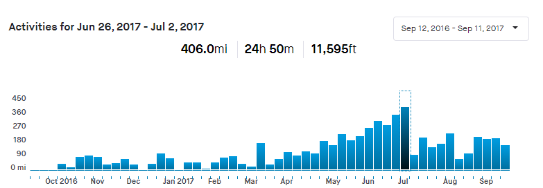

**Chris S**

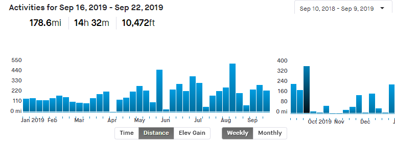

**Spencer R**

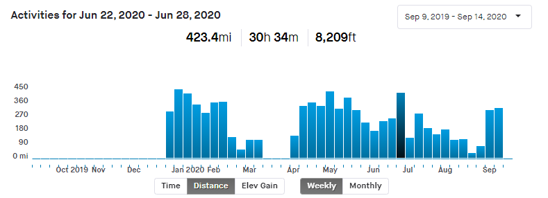

**Aedan H**

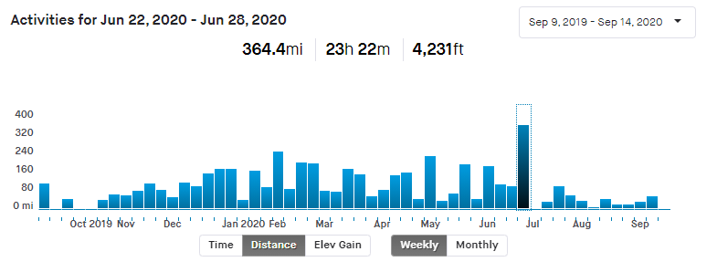

**Kevin B**

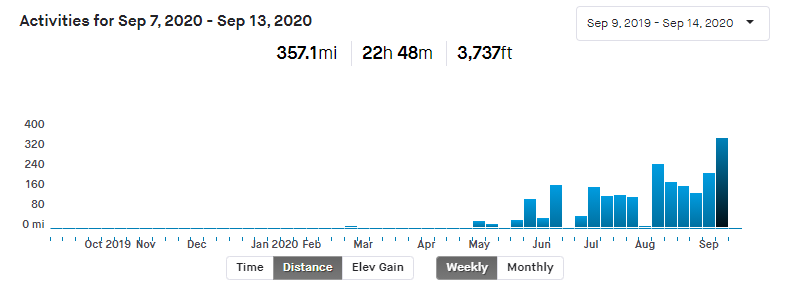

OK OK OK before you start into how I didnt train properly I was doing a very strict, very significant lifting routine for November through February. This taught me a whole slew of things that I didnt know before, and prepared me a lot more than I realized to do this ride. I'll get into this later. The main point is, while it looks like I wasnt biking. I was staying extremely on top of my fitness through the winter, and I had biked a similar amount of miles in the summer the year prior. So I wasnt completely unprepared. But yeah the rest of these guys are legends.

Things to note. The highlighted bar is the week of the route. I had to splice annual charts for Chris to make it fit correctly. These guys bike. This is not a thing you can just reach out and do. You have to put in the miles. You have to know how to do big time mileage and you need to be comfortable with some semblance of training. They're in order of completion (I think).

Have a look at Sean's preparation. He's scaling up into enourmous mileage and he was riding weekly through the winter (are you riding weekly through the winter? well you better pick it up then). Then check out Chris, he's got some monster randonneuring experience earlier in the year having done even more miles during a week 6 weeks ahead of this solo ride. These guys put in a ton of biking to be prepared, and were familiar with the task at hand. Spencer is a triathlete machine. His output put fear into me everytime I opened strava. Casual 80mi morning rides with 9mi runs in the evenings. Come on man. And Aedan having a constant output year round, knocking out 200+ mile weeks in February? What I'm getting at is if you're thinking about doing this ride and you arent making 150mi weeks the norm you are probably not pushing out enough hours of cycling. 

"Ok Kevin, but what about you, why dont I just copy you so I dont have to spend 6+ months training?" Because I have some unique history that gave me a boost. I had previously done a cross country solo bike tour... without really knowing what I was doing and not really knowing how to camp. It was a disaster (a beutiful, wonderful disaster), but through this disaster came a lot of understanding of my limits and what breaks me. So while I wasnt spending a lot of time on my bike in comparison, I knew I had the legs to get me through, and I knew exactly what was going to stop me. I spent all my energy learning about how to stop myself from hitting any walls along the way. In retrospect should I have trained more, yeah sure. Its easy to say you should have trained more. But was that my biggest failing? probably not. Also almost every mile of my training was on the GAP, I became extremely familiar with the entire 145 miles and while that doesnt seem like much of a help, knowing exactly how to manage your first 8 hours helps smooth things over greatly. Also, there is a lot of room for improvement in other areas outside of training. Its less about fitness than it seems on the surface.

### T0 Training

Scale up your riding to 250+ miles a week (Hey I said this was going to be all out). Do almost all of your riding on the Gap or C&O. If you dont have access then find something as similar as possible. Work through every single step of your water and hydration needs. Take notes on how hot it was, how much water did you drink per mile? per hour? After your ride did you weigh significantly less than you did before you left? You feel pretty good after a ride even if you're severly dehydrated. That doesnt really set in unless you're on the longer rides.

Use your long rides to the fullest. These are your safe test cases. Pack all your bags, put them on your bike and go do a 200 mile ride with a heart rate monitor. Was your pacing on point? How much water did you need? Will you need to have even more water on board? Is there a certain threshold of heat or humidity that changes your game in a severe way? These are the things to sort out.

I'd recommend at least two 200+ rides in preparation. I'd do 1 on the Gap and 1 on the C&0, preferably the starting from the point in pittsburgh for the gap ride and ending at mile marker 0 for the c&o ride. This will get you familiar with the starting and ending points which will free you up to focus on just the cycling when it comes time. Fully load your bike, execute your plan of no stopping except for water. Practice eating on the bike. This comes up in the next section but you need to completely understand how many calories you are actually burning. The best way to do this is to track every calorie on and off the bike and compare mileage from week to week. You'll get a rough estimate of how many calories cycling costs. Sprinkle in normal road cycling if you want, but I'm making this plan as if your entire life revolves around doing this GAP + C&O ride as fast as possible.

I will admit when it comes to training I'm not a super reliable source for information. I tend to get good results from "bike as hard as possible as much as possible when you feel like it." I've gotten better at taking rest days or 3 when something was feeling off. Getting max efforts and max data out of your rides goes a long way. Some may disagree and prefer a more 40 miles a day at race pace stratagy, but bursty big rides seemed to work for me.

### T1 Training

Scale your riding to at least 150 miles a week. You need to feel comfortable on your seat and you need to be very confident in your body positioning. The miles will come with time. The longer you can be riding at 150+ the easier this will be. Your pace needs to be quick but not fast. You have time to stop and rest so practice timing your stops. Learn what it really means to stop for 5 minutes. Go bike 30 miles without stopping, set a timer for 5 minutes and get back on and ride home. Then think about doing that 5-6 more times. Does that seem unreasonable? Why? Work through those answers as you build up miles and consistency with your pace. I'd recommend getting a lot of miles on the gap. Also it would be good to get some practice stopping at sheetz. Like the stop in Connellsville or any other small towns. If you can know how to get to and from the trail efficiently as well as get in and out as fast as possible that would be great. If you're riding with a friend knowing who will get in line and who will refill waters and such would be good to plot out as well.

Another thing about practicing your stops is you'll want to know when to bail. If you get to a spot and you really need food, you might have to suck it up and wait the 20 minutes at a busy gas station. To avoid this you will want to know when to order food, when to grab a energy drink and go, and when to just abandon ship and get back to the trail. You should plan your stops ahead of time, but always have enough supplies to make it to the next one so you're flexible enough to skip some long lines if need be.

I would highly recommend getting at least some miles on the C&O before making a go of it. Its quite a different animal and will certainly slow you down.

# Nutrition

First I'm not going to get into Keto and all that. This is just what I did, I mainly tracked calories, found my calories burned and tried to eat as much as possible while riding. This isnt a "the best nutrition guide" its what I did to make it happen. Some parts of this are just good advice, but if you're a health nut, you know what you're doing so dont go changing to match this guide.

You're going to want to know exactly what food you will want to take, this will come with training. You will learn what you do and dont like to eat, and especially what you dont like to eat after 100 (or 200+) miles. Your tastes change pretty significantly based on how much you're working and sweating and a lot of times I'd be really put off by something that I usually love and start day dreaming of some obscure salty snack or whatever. Its a matter of honing in on what you like and then how you manage eating it. A good portion of the food I took I ended up not eating, I had expected to be more interested in some stuff but couldn't stomach it. You should be practicing all of this on every single ride.

Heres a list of what I took, it was enough calories, but I didnt finish a lot of it.

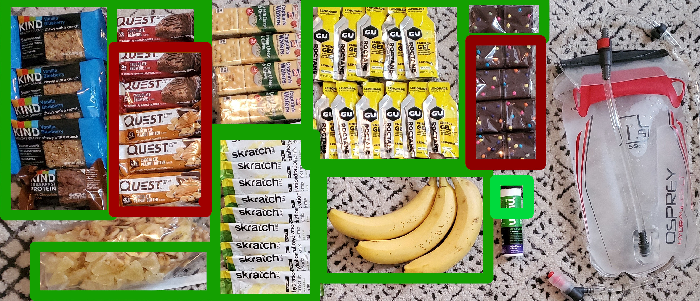

- 5x Cosmic brownies (love these, pack alright, high calories)
- 12x GU without caffeine (Picked these up just for the trip, needed more easy to eat calories and they were a life saver)
- 3x Banana (classic, put em in my jersey to start off)
- 1x Nuun tablets (40mg caffeine and vitamins, just figured itd - be something other than scratch)
- 10x Scratch (put in every bottle I had until I was out)
- 4x Creme Cheese and Chives (favorite crackers)
- 6x Quest protein bars (pretty regular thing for me to eat)
- 1x Massive mixed bag of banana/pineapple chunks
- 5x Kind bars (pretty regular riding food for me)

Everything in green I ate, the red were some pretty bad sticking points worth mentioning. The protein bars were the worst, it was like my body knew it was fake sugar and didn't want any part of it. The cosmic brownies were also tough to stomach. I used to like eating them but I think those rides were a bit less strenuous.

I started off with the GU in a cup holder bag along with some salt tablets that are not pictured. I tried to eat a salt tablet every 2 hours or so during the day in addition to the food in order to make up for the sweat. I sweat a lot. The crackers were awesome, but kinda hard to eat. The dryness makes it pretty easy to breathe cracker dust in, but man I just love these crackers. I also burned through the kind bars pretty quick.

My first few hours were:
- Banana + Kindbar + Scratch
- Banana + Crackers + Scratch

When the bananas ran out I switched to other foods. But would have liked to have stuck with that rotation. The GU was amazing but I saved it for much later when I didnt feel like chewing.

Another thing to keep in mind is the difficulty to eat while riding. You need to be eating a lot, and you'll also be sucking wind pretty good. I mentioned the crackers, but even the granola bars got crumbly which made it a challenge to not drop pieces. Whatever food you're taking, try smashing them up in your hands for a while then try to eat them. Thats what it will be like when you get it out of your bag 14 hours in. Also figure out how you're going to store it on the bike in a way thats easy to access. I'd recommend absolutely stuffing your jersey pockets full. I think a frame bag would also work well but I dont have experience with that. I put 4+ snacks in each of my 3 jersey pockets, this would last me 4-6 hours. Also keep in mind that you'll want a pocket for trash, so try to empty out a pocket first so you can start stuffing trash into it. Then when you hit a water stop you can dump your trash, refill food if needed and get back to it.

In retrospect I would have done twice as many kind bars and crackers 6 more GU and cut the protein and brownies. It would have been nice to have more bananas but they're hard to carry and pack. Also more scratch would have been nice, I didnt like the Nuuns I took when I got to that point. I also should have made little bags of the pineapple and the bananas. I only had one big bag which meant I could only have them during stops.

I think my carb limit is about 100g of carbs / hour. But I only averaged like 60g of carbs / hour for the whole trip.

I also forced fluids the entire time. The only way I knew I was hydrating properly was if I was peeing. My strategy was "Do I have to pee? no -> drink gulp of water, yes -> drink sips of water." Then I held my pee as long as I could to avoid unneeded stops (at least at the beginning when I wasnt constantly stopping).

Another thing to note is I hit breakfast pretty hard, I had 3 eggs, 3 pieces of toast, a monster of a PB&J and as much gatorade as I could chug. I wanted to be bursting with sugar at the start. I would have tried to do a double breakfast if I was going for it again. Wake up, breakfast, get ready, 2nd breakfast. More on this in the execution section.

At my only stop I ate a rice crispy treat and 3 chicken wraps. I then picked up 2 Monster Maxx cans. I drank 1, but I shoud have picked up more cans because this ended up being basically the end of my caffeine, which was rough.

My total calories for breakfast + riding was as follows:
- 1375g   Carbohydrates
- 170g    Fat
- 132g    Protein

My normal day is obviously far less calories, for the summer of cycling I tried to stick to about 1/3 of each, and ranged from 2300 to 2800 calories.

### TO Nutrition

You have to know **everything** about what you will need. You're going to pack in all food and not stop anywhere, so you need the exact amount of calories with a little buffer. You cant underestimate. You will want to track every calorie during your training along with your weight. Use any tracking app but use it constantly. Before and after rides weigh yourself. You'll want to be trying to get your pre-ride weight into a narrow enough window and make sure you're finishing at the same weight (meaning you're not losing water). This will let you know exactly how much water to be drinking. 

Then take the number of miles you do per week and divide by the number of calories. Or subtract off your basal metabolic amount from each day if you can get it close. Again you'll want to over estimate on how many calories you burn on the bike but there is an upper limit to how much your body can absorb. Assuming you havent been losing weight and assuming you're able to keep decent track of all calories, you should now know about how many calories you burn per mile and also per hour. Using these values you can estimate your need for your bike trip.  The vast majority of your intake should be carbs and you should not be letting a single 30 minute block pass without eating something. 

My biggest piece of advice here is to really really know what you like and give yourself options. If you like 6 foods, take ample amounts of all 6 and then force yourself to eat the ones you arent feeling as much at the beginning. At the end you're going to be depending on the GU or whatever is easiest.

Also consider how you're going to do caffeine. I find it hard to imagine you're reading this and also a person who doesnt drink a lot of coffee or whatever. You'll need to sort out exactly how you'll dose this out, this seems like a pretty personal thing so I'll leave this up to you.

### T1 Nutrition

I'd recommend if you're trying to do a sub 24 to limit the amount of stuff you're carrying. Just bring a bit more than you need to accomplish the miles to the next stop. I'd also recommend carrying enough to make it to the next stop incase you have an issue and need to skip a town, plus it opens up your options a little. The best thing you can do is really really understand your stops. You'll be able to comfortably pick up food at your stops so just know what you'll want as you approach. Then know how to get to and from your stops correctly.

The above T0 information won't be a important because you'll have the options to refuel as needed during these pit stops and that should really help smooth out your riding. I would recommend doing some practice stops in training and timing them out. Find out what an average stop is for you and then make sure you arent scheduling too many for you to make it in by the 24 hour mark. They add up super quick. A 15 minute stop is very very easy to do, 25 minutes will sneak up on you really quick. 4 towns at 25 minutes will pretty much ruin your chances. You'll want to keep tabs on it during the ride to see if you'll need to skip a stop. Also dont go too wild with the food. Sometimes having so many options will be dangerous, you'll get a little too aggressive with "I love spicy cheese chips" or whatever, but then an hour later be suffering with an upset stomach. So know your limits and do what you need to do.

# Gear List

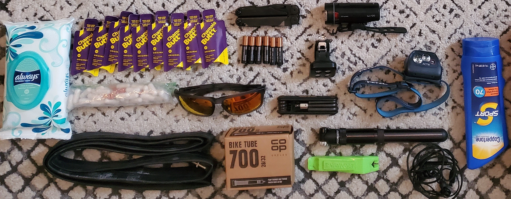

Ok this was the part I was really concerned about. I didnt know what was safe to cut. I knew I'd be in uncharted territory. I had only had my new bike for like 250 miles which I knew was a major potential red flag.
Ok so gear list:
- Chamois Creme
- Bontrager 120 lumen light
- Headlamp
- Spare batteries for lights
- Leatherman
- Small back-up light (not a riding light really)
- Bike tool to adjust seat or whatever if needed
- 2 spare tubes
- Bike pump
- Tire Tool
- Headphones
- 6 Ibuprofen
- 6 Tylenol
- Handful of salt tablets
- Sunglasses
- Safety goggles (not pictured)
- Wipes
- Neosporin
- Sunscreen (I didnt end up taking)
- Battery Pack (not pictured)
- Bike computer - Elemnt Bolt (not pictured)
- Aero Bars (not pictured)

So I'll just go in order an check in on every piece. Chamois creme is a magical thing. I never really rode with it but I have had some recent saddle sore issues so I had done some training rides with it and holy smokes you just gotta have it.

The headlight was bad. Its an ok headlight but I really just needed a better one. I had the headlamp and I thought that both would light up things pretty well but late at night when you're fading out you want absolutely no lighting issues. I'd recommend going way above what I rode with. I'd say 3x as bright. I have longer plans to work with a dynamo hub and such but for this ride you dont need it, but you do need a brighter light. So get some practice with actual hard night riding. Not pretty dark streets. Go out in the woods and try to bike 16 mph in the dark with your light. If its not extremely easy, you need more light.

Check this out, you want something that looks like the right, not something that looks like the left:
https://www.bikelightdatabase.com/beamshots/#left%5Bmode%5D=117&left%5Blight%5D=volt100&right%5Bmode%5D=120&right%5Blight%5D=volt700
Note that those lights are only rocking 2 hours of battery life. So this isnt a recommendation for a light, just advice for what you want your trail to look like when its lit by your light (also there arent any reflectors on the trails.)

I took a leatherman beause I find that if something goes real bad its nice to have the option to get surgical with some pliers on a broken deraileur or whatever. Also the bike tool is obvious. You may need to tighten handlebars or change your seat or whatever so you dont want to be without it.

Two spare tubes was totally enough, I didnt have any flats, but it was an old rule of mine on longer trips to have 2 spares so you're not terrified when you replace a flat. The new bike has storage in the down tube for the flat kit so its pretty easy to just toss another tube in the bag.

Headphones for music. This is completely needed on a normal ride, but for some reason it just didnt work the same on this trip for me. I made it to the last 100 without music and when I put it on it was just too late to motivate.

I brought some pain killers but I didnt want to be super loaded up on pills the entire time so I ended up taking 4 of each over the last 150 miles. The salt tablets also were nice, I'm a pretty sweaty person so I had been training with some salt pills and brought them along. The weather was overall very cool so I didnt feel pressured to take them. I think I took maybe 5 over the 23 hours.

Sunglasses are required gear, cant bike very well with bugs or rocks in your eyes. These trails are also pretty full of gnats at different points. For night riding I bought some saftey glasses and these were the 5 star item of the trip. When the sun gets low, switching to the clear glasses brightens up the whole world and just makes you feel more awake.

I wasnt sure what the damage would be as far as saddle sores are concerned so I got some wipes. They were never used. I was glad I had them but I never had the time to properly reset. If I had taken a 5 hour break or whatever then doing a proper clean up with wet wipes is a game changer. But when you're filthy and gross and you only have a few minutes to spare its just too low of a priority. I also had some numbing neosporin incase of open sores, again never used. I would have liked to have cut these items but at the time I was pretty worried about it so I wanted the option.

I loaded up with suncreen in the morning and checked the forcast. It was to be overcast and reasonably cool so I just decided to put it on heavy and leave it. This was fine for me in this one instance but I'd not recommend making this decision lightly. I did get slightly sunburned still, thought that may have been more wind burn than sunburn.

I took a Nitecore NB10000 powerbank with me. This had enough to fully charge my phone at least 1.5x as well as my bike computer from dead to full. I tested this. Multiple times. I would let my phone die, and practice recharging. I made sure I had the cords for charging and that they reached what I needed to reach. Like from my top tube bag to my bike computer. 

I like the Elemnt Bolt, but I'm sure theres a wide variety of great gps units so I wont pretend to know better. This worked for me. The battery life was great, but I made sure to charge at the 10 hour mark to re top off the battery (then I forgot to charge my phone which ended up dying later).

Aero bars. I love them and hate riding without them. Not having them just doesnt make sense to me for this kind of thing. I'm not saying take a time trial bike, its just that the bars let you take the weight off.

### TO Gear

This is obviously rider dependent to a high degree. I would say that aero bars are just free energy savers. You get the mild aero benefit, but you save your hands and your back and shoulders. Its just such a huge benefit to have the option to keep a different stance when you want. For sure a great thing to consider.

Other than that I wont say anything other than to cut everything you think you can cut. Get rid of that weight. I'd also say organize your gear to really maximize efficiency. There were times I'd have to remove gear from the bags to get to my other stuff. Would have been nice to be able to have bag dividers that would keep things cleaner and more efficient.

I'd also go tubeless. I wanted to but ended up opting to just run with what I had and carry tubes.

Gear is an area where I'm still learning a lot, so I feel like if you're reading this you probably know better than I do.

### T1 Gear

I'd say breaking the 24 hour barrier is really gear independent. Its not like having a leatherman or not is going to save you the weight that will push you across the line. Make sure you have enough of the stuff you know you'll need, like Chamois creme, and make sure you have tested out the lights. I set up my lights pointing at the wall in a dark room, then I took a picture. 8 hours later I went back and checked the light by comparing another picture. Based on that I decided to take extra batteries because it made enough of a difference. Granted I never changed them but I was a bit concerned.

Also you may want to practice a flat if its been a while. Time yourself and see how long it takes to unpack, swap the tube, and repack. If this takes you 30 minutes you may want to practice on it. You're trying to hit the sub 24 mark so you'll not want a routine mechanical to put you out. Bonus points if you set an alarm for 4am and do the wheel change groggy and by headlight. 

# Bike Setup

So back to the aero bars. I just love them, it helps me keep a constant position, it feels like its easier to engage my glutes and keep my pedaling consistent. I hung a bag off the front, on the top tube, one off to the right of the inside of my handle bars, and one off the back of my seat post.

- Oveja Negra -> seatpost bag https://www.ovejanegrabikepacking.com/collections/seat-bags/products/gearjammer-seat-bag
- Oveja Negra -> top tube bag https://www.ovejanegrabikepacking.com/collections/top-tube-bags/products/snack-pack-top-tube-bags-large-xl
- Oveja Negra -> chuck bucket https://www.ovejanegrabikepacking.com/collections/handlebar-bags/products/chuckbucket-handlebar-bag
- Restrap -> aero bar bag https://us.restrap.com/products/race-aero-bar-bag

Shoutout to my wife Sarah Skelly for the Oveja Negra bags. She's a cycling machine and does all the research and reading and testing to find great bags, and then I steal them.

I had a lot of concern about the water, I had been running out of water between stops in some practice rides on the GAP, granted it was like 95 degrees out. But this fear made me realize I would absolutely need more water. So I decided to use the front bag to hold a water bladder (pictured on the right in the gear image). It was only 1.5L and I put a jacket in the front mainly to help the water bag sit better. I drank from the bottles first then if needed would sip on the hose that I wrapped around the bag and up into the handlerbars. This gave me 3L of water. This was more than enough, but I did dip into the reserve quite a few times. During water stops I usually didnt fill the reserve. I knew it would be tedious to un pack and repack, so I only refilled it when I knew it was getting low, and that was only once on the trip (about 7 hours in).

The front aero bar bag was pretty good for keeping some extra snacks attached to the top between the bars. I also attached my bike computer to the right side of the aero bars. The chuck bucket bag was on the outside of the aero bars, behind the handlers bars. If I was out of the saddle my knee could hit this bag, but I didnt plan on standing much. In the chuck bucket was all my GU, Scratch, and salt/pain killer pills. Having these things handy was important. Being able to grab scratch easily without digging around in a bag was great and being able to snag a GU when you're dying at the end was convenient. The bike computer had only heart rate, average heart rate, speed, average speed on it. I had another page with distance and moving time etc on it, but I didnt want to be seeing that the entire ride. HR and speed were the things I could control. 

In the top tube bag I kept my wallet, battery pack and cords, and phone and headphones. This is the bag that is 100% on my bike. On training rides this is where I keep my phone and wallet etc. I cant imagine riding without it. I did check to make sure my cord would reach from the battery pack to the bike computer. No complaints here. 

The seat post bag was packed with medical stuff the deepest, then tools, then food. I knew I'd be grabbing that food and was hoping not to have to get into tools and medical stuff. Again I didnt want to be getting into this bag very often so when I did I made sure to top off my food and stuff my jersey pockets.

I also ran my light off the front of my drop on the right handle bar. This was dumb. My shifting levers hit it. I had no where else to put it, so I just switched it to the left as I was in the big wheel 100% of the time anyways. I really should have figured out my lights better.. 

### T0 Bike Setup

The only advice I can give here is to not keep your wallet with you, pack it in somewhere cause you're not stopping anywhere. Also I'd make sure to do lots of testing and trials with your set up and not change anything up last minute. You will be tight on some room if you cut a bag, or want to take extra stuff so make sure you're packing efficiently and managing your space effectively.

I will note that I did this on bontrager r1 hard-case lite 700x32c tires. They obviously worked but I was wondering about the choice as I slid all over the trail on the C&O. I think if it had been drier it would have been fine, but keep that in mind. I also didnt have them super inflated as it helps with the bumps of gravel. I smashed some big sticks and potholes hard which made contact with the rim a couple times which had me wincing and fearing a pinch flat. I think a slight step towards a gravel tire or something with a tad more tread would have been better. It is a trade off though, I felt very very comfortable on the GAP so I geared for that and figured I'd face the demons on the C&O (which I certainly did).

### T1 Bike Setup

Take less bags! If you're going to be stopping for food a lot, just take less stuff. You will for sure need bags though, there is a pretty big gap in food towards the end on the C&O so you'll need to carry stuff. But you dont need to be worrying about how to pack in 10,000 calories of food, just pack what you need and do test rides with all your gear fully packed. Dont swap out your bike setup for something new the day before your ride.

# Route Planning / Weather Considerations

Theres not much to say when it comes to the route, continue straight on the GAP, then continue straight on the C&O. However, there are some parts where it is a little confusing. There is a spot on the C&O where you come out of the trail onto the road and in the night it was hard to know you have to turn right and then then left back onto the trail. This was not something that was super difficult but I lost a minute sitting on a road looking at my phone making sure I was going where I needed. I would absolutely without a doubt do a ride out of Pittsburgh. From the point, go to the water front, then to mckeesport, then across the bride and along the road up and over a small hill until you hit the gravel trail. I could absolutely see why this would be confusing for people never having done it before. There are a lot of assumptions (oh i guess just... go down this road now?) and its not as well marked as it should be. The first 3.5 miles are a little weird, then you build up a bunch of confidence on the paved section. Its pretty straight forward to the gravel trail in the water front but once you get to/past mckeesport you'll want to also know what you're doing.  I'd recommend doing at least the first 25 miles out of pittsburgh once before you do your trip. You'll probably want to do more, but if you're from out of town I highly highly recommend making the trip once before hand to get familiar with the first 25. Its just not worth losing 5 minutes in the first 10 minutes of your trip getting turned around. Its pretty well marked on google, but in person it just feels unintuitive during some bits.

As someone out of town when it comes to DC at least its pretty obvious where you're going, until you get to the last mile. The marker is extremely difficult to find for some reason. You end up biking through a parking lot kind of thing to find the mile marker 0. I'm going to do a comprehensive run down of this because this was an infuriating thing to try to sort out.

The C&O Canal Towpath runs along the water and is gravel. It looks the same as it has for the last 100 miles. Suddenly there is a trail on the right as you come into town. It is a paved. It is lovely. I did not take it but I was getting confused because I thought I was supposed to be nearer to the potomac river. That paved trail is called the Capital Crescent Trail. As you continue onward it gets even worse. There is the Capital Crescent Trail head, and then on the other side of the canal is the C&O, yes there is another branch of the C&O that now exists.

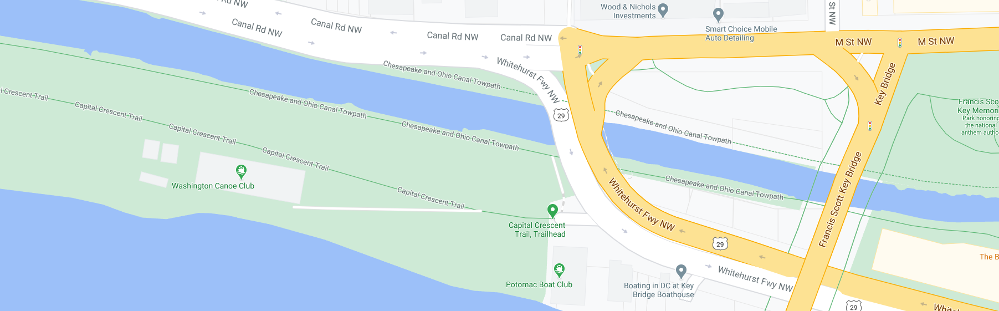

So you're staying on the C&O you've been on the whole time, but then what happens is you'll run out of trail. Below you can see the trainsitions of the trail, you're on the green and you'll need to figure out how to get across the river to the orange trail which is the other branch of the C&O, this will take you to the trail head.

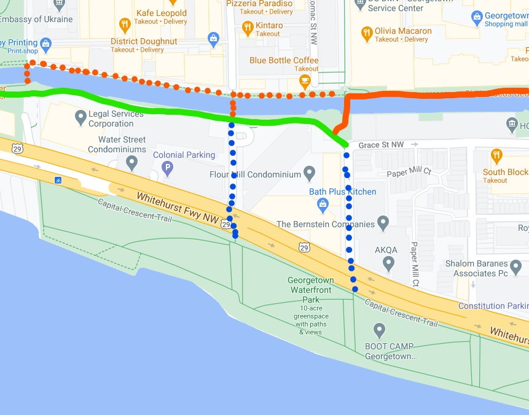

Ok Kevin but why are you putting those marks down to the Capital Crescent trail? That has to be the wrong way right? Wrong. Or well. I dont know. I think this all comes down to what you're trying to do. I'm certainly not going to judge you for taking one trail or the other. At this point I'd say you've done your best to get to DC on the trail, I'd pick one and finish it out. You may ask, why would you want to take the trail that is obviously the wrong name, well as you will see below, thats because its actually the fastest way to the C&O Canal Towpath Mile Marker 0. The C&O canal trail marked in orange above leads to Lock 1 and the trail head seen here:

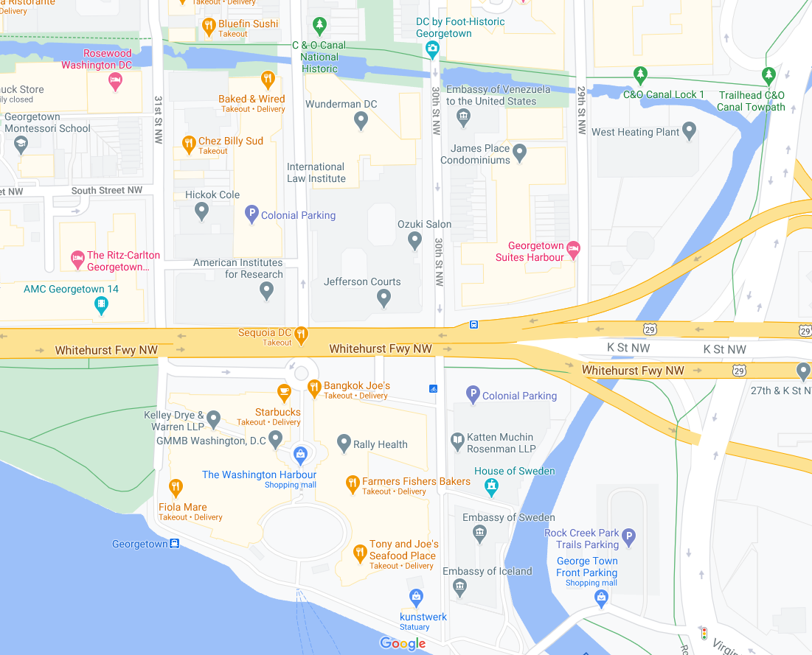

In this overview picture below you can see the conflict of interest. Does the C&O trail mark the end of the journey or the C&O Mile Marker 0? I think either is valid and honestly after 330+ miles you've earned it. Just pick one and know ahead of time which way you plan on going so you're less likely to get turned around when your brain is no longer functioning.

!{}(Images/Overview.jpg)

Ok thats the end of my ranting about the finish. I found this very confusing in preparation and also in execution so I'm not sure what way is the correct way, I just wanted to see mile marker 0, so thats where I went. I dont think anyone who has done this is going to look down on you one way or the other (but I will say if you just end it when you feel like the C&O doesnt go anywhere I will say "hmm looks like you skipped out on the last mile" or something snarky like that). Fair warning.

One more thing I'd like to mention is the weather. You're going to probably want to be planning for a June trip and hopefully finding yourself a nice cool day. However there are a lot of factors I'd keep in mind here. If it has rained recently (which unfortunately for me it had) on the C&O you can for sure expect branches and trees down and a lot of mud. I'd shoot for at least 3-5 rain free days for the C&O. I'd also be routinely checking Windy.com for wind and temperature information (another shout out to my wife Sarah for being a weather nut). The site provides a ton of detail and has been generally accurate multiple days in advance.

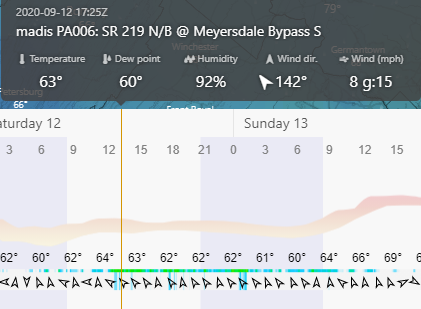

I was also unlucky with wind as I had a pretty rare wind out of the SE which meant headwinds for a lot of the trip. This is pretty rare, but also something worth investigating.

### T0 Route Planning and Weather

You're going to for sure do the first 25 miles of the GAP at least twice. You will also be doing the final 10 miles of the C&O twice, preferably at the end of some long rides and also at night. This will be your best way to prepare. You will also be retired or at least willing to take off days when the conditions are perfect. You cant trust that the weekend will be the time to do it, so you're going to keep your June open and monitor the rain NW of DC. When you have no rain for a while, and the weather is good enough for you to rock, you'll make your final prep and go for it. Hey do you want sub 20 hours or not, I thought you were taking this serious.

### T1 Route Planning and Weather

Just make sure you've thoroughly walked through the ends of the route on google. Be willing to double check your phone or even keep your phone out for the start and end of the ride. You dont need to be as concerned about the absolute perfect conditions, but you for sure dont want to be actively getting rained on.

# Execution

So we've made it. Execution. This is probably going to be a long section. I'm going to walk through my thought process first and then I'll write myself some T0 advice and a brief T1 sub 24 advice section. 

