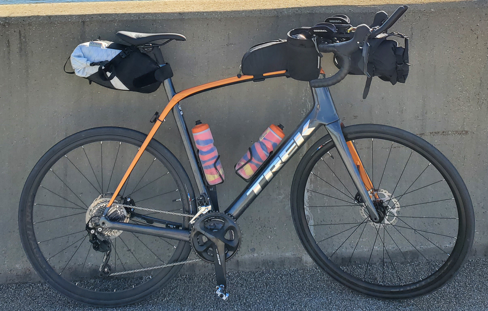
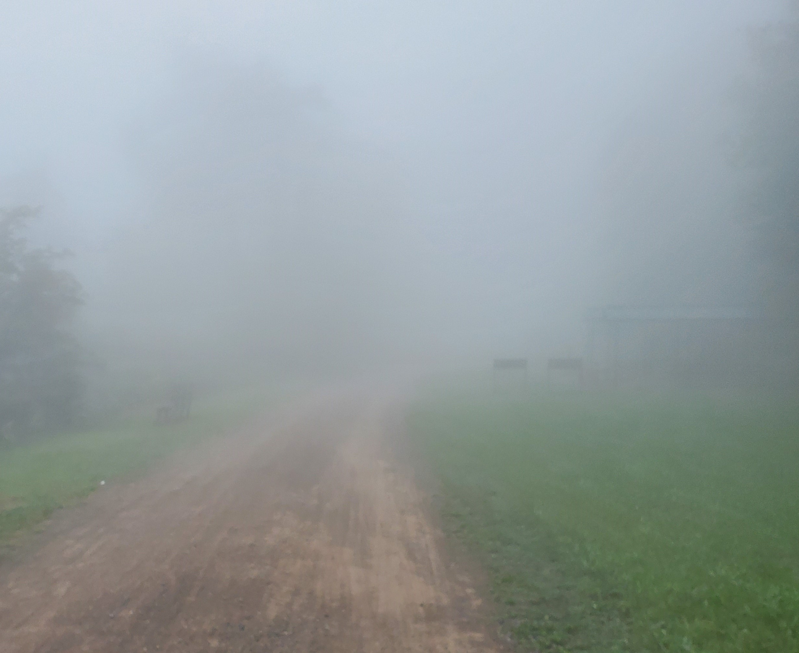

# Pittsburgh to DC in under 24 hours
More specifically: Biking the Greater Allegheny Passage and C&O Canal Trail Solo Unsupported

As someone who loves to analyze things, prepare for a lot of overanalyzing. I'm going to go all the way through every step of this trip in a way that I wish existed when I decided to take this on. Hopefully someone is reading this because they want to take on this awful challenge and I'm going to do everything in my power to make you think "Oh this doesnt seem that bad, maybe someday." Then the idea burns for a while and you'll come back looking for all these tips. To save everyone else the agony of reading through the overly detailed info, first things first. The Trip report.

# Greater Allegheny Passage

### Part 1: 0mi -> 60mi  |  Average Speed: 17.8  |  Miles to go: 273

I triple checked that I had everything sorted at attached correctly, stuffed the food that wouldnt fit in my bags into my jersey's back pockets and left the house. I biked from Bloomfield down to point state park. I have been here a whole bunch of times on a whole bunch of rides, but I had never been this nervous. I sent my wife and inspiration a text "I'm at the point" and I was full of cautious confidence on the "You are strong!" response. The ride out of Pittsburgh can at times be a little confusing for people doing the trip and its not unusual to find adventurers seeking confirmation that they're on the right path. There are also 2 points during the first few miles where you are at the mercy of stop lights and traffic which can interupt the flow pretty significantly. Upon hitting both of these lights.... THEY WERE GREEN! What a great sign, out of Pittsburgh and onto the open trail.

The GAP is paved for a lot of miles out of the city and its easy to get carried away, I wear a heart rate monitor and had that front and center on my bike computer. Talking myself back down when my heart rate went higher than 155bpm. There are far too many miles ahead to be excessively burning energy. Pace was important for me here. The trails were busy but not crowded. Easy sailing past all my normal turn around spots and after an enjoyable morning ride I was at my first stop.

I bought 2 energy drinks a huge rice crispy treat and 3 chicken wraps which I ate as fast as possible after waiting about 10 minutes. It was during this wait that I realized I didn't *need* to stop and get food and supplies. I was carrying more than enough food to get me through to the end and there are relatively frequent spots to get free water along the trail. So this was it. I previously thought about not stopping but changed my mind as I thought the breaks could be used effectively. Standing waiting for food however was not a good use of time. So thats it. No more stopping at shops. Off to take on the mountain.

### Part 2: 60mi -> 110mi  |  Average Speed: 16.4  |  Miles to go: 223

There is one climb on the GAP and its a long one, you climb up and up and up. Realistically its not a huge climb in elevation, about 1500ft, but its just. so. long. About 60 miles long slowly climbing up. It might not seem like much of a gradiant but its a stark contrast to the truly flat first 60 miles. I was making great progress but I had seen there would be headwinds for a good amount of the trip and that they'd be worse the higher up the mountain I climbed, but I underestimated how unsettling it would be watch your speed numbers drop so significantly. This was starting to take a toll on my mental state, but its ok! We will gain it back on the downhill, its going to be great! Keep going you're ahead of schedule still. It is getting cold, and this fog is looking less and less like its clearing anytime soon.. maybe this is just a cloud.

### Part 3: 110mi -> 120mi  |  Average Speed: 14.3  |  Miles to go: 213

This was the first tear drop. I'm not ashamed to say this trip pushed me to tears, I knew it would. I am however, pretty disappointed I barely broke 100 before the frustration started setting in. This was a devasting 10 miles. The top of the mountain was full of fog. I was cycling through the clouds, cold wet clouds. There was a steady 10mph wind pushing directly against me. I was eating food knowing all the energy was being spent going against this wind and not going towards my goal of finishing 300+ miles. I really really didnt want to quit, but this pace was a marker of future failure. I could not go any slower and expect to finish. I knew the downhill was ahead and hopefully the warmer less wet air would bring some relief, round two of tears was hitting Big Savage Tunnel. Usually breaking out of the tunnel is met with 