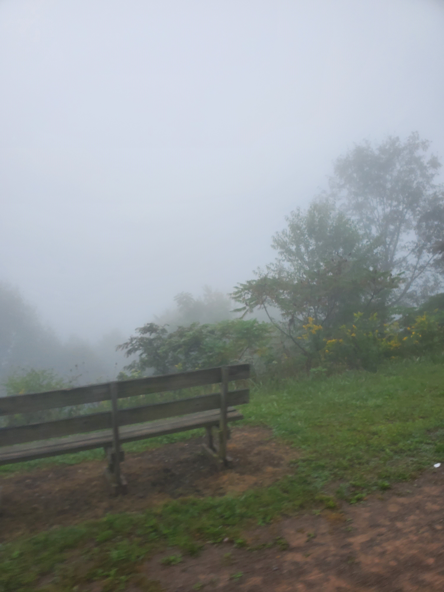
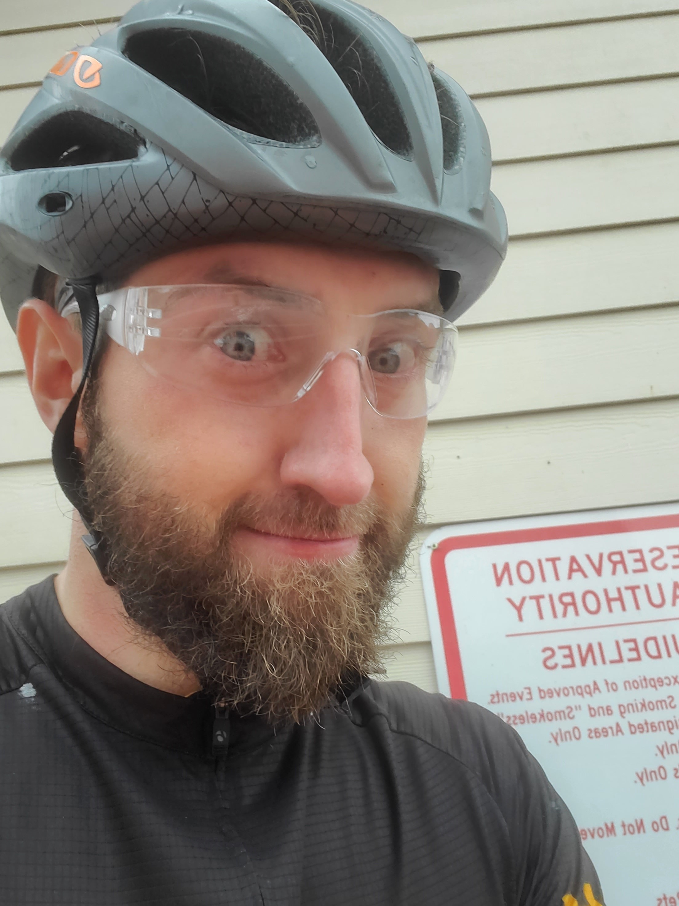

# Pittsburgh to DC in under 24 hours
More specifically: Biking the Greater Allegheny Passage and C&O Canal Trail Solo Unsupported

As someone who loves to analyze things, prepare for a lot of overanalyzing. I'm going to go all the way through every step of this trip in a way that I wish existed when I decided to take this on. Hopefully someone is reading this because they want to take on this awful challenge and I'm going to do everything in my power to make you think "Oh this doesnt seem that bad, maybe someday." Then the idea burns for a while and you'll come back looking for all these tips. To save everyone else the agony of reading through the overly detailed info, first things first. The Trip report.

# Greater Allegheny Passage

### Part 1: 0 -> 60  |  Average Speed: 17.8 mph  |  Miles to go: 273

I triple checked that I had everything sorted at attached correctly, stuffed the food that wouldnt fit in my bags into my jersey's back pockets and left the house. I biked from Bloomfield down to point state park. I have been here a whole bunch of times on a whole bunch of rides, but I had never been this nervous. I sent my wife and inspiration a text "I'm at the point" and I was full of cautious confidence on the "You are strong!" response. The ride out of Pittsburgh can at times be a little confusing for people doing the trip and its not unusual to find adventurers seeking confirmation that they're on the right path. There are also 2 points during the first few miles where you are at the mercy of stop lights and traffic which can interupt the flow pretty significantly. Upon hitting both of these lights.... THEY WERE GREEN! What a great sign, out of Pittsburgh and onto the open trail.

The GAP is paved for a lot of miles out of the city and its easy to get carried away, I wear a heart rate monitor and had that front and center on my bike computer. Talking myself back down when my heart rate went higher than 155bpm. There are far too many miles ahead to be excessively burning energy. Pace was important for me here. The trails were busy but not crowded. Easy sailing past all my normal turn around spots and after an enjoyable morning ride I was at my first stop.

I bought 2 energy drinks a huge rice crispy treat and 3 chicken wraps which I ate as fast as possible after waiting about 10 minutes. It was during this wait that I realized I didn't *need* to stop and get food and supplies. I was carrying more than enough food to get me through to the end and there are relatively frequent spots to get free water along the trail. So this was it. I previously thought about not stopping but changed my mind as I thought the breaks could be used effectively. Standing waiting for food however was not a good use of time. So thats it. No more stopping at shops. Off to take on the mountain.

### Part 2: 60 -> 110  |  Average Speed: 16.4 mph  |  Miles to go: 223

There is one climb on the GAP and its a long one, you climb up and up and up. Realistically its not a huge climb in elevation, about 1500ft, but its just. so. long. About 60 miles long slowly climbing up. It might not seem like much of a gradiant but its a stark contrast to the truly flat first 60 miles. I was making great progress but I had seen there would be headwinds for a good amount of the trip and that they'd be worse the higher up the mountain I climbed, but I underestimated how unsettling it would be watch your speed numbers drop so significantly. This was starting to take a toll on my mental state, but its ok! We will gain it back on the downhill, its going to be great! Keep going you're ahead of schedule still. It is getting cold, and this fog is looking less and less like its clearing anytime soon.. maybe this is just a cloud.

### Part 3: 110 -> 120  |  Average Speed: 14.3 mph  |  Miles to go: 213

This was the first tear drop. I'm not ashamed to say this trip pushed me to tears, I knew it would. I am however, pretty disappointed I barely broke 100 before the frustration started setting in. This was a devasting 10 miles. The top of the mountain was full of fog. I was cycling through the clouds, cold wet clouds. There was a steady 10mph wind pushing directly against me. I was eating food knowing all the energy was being spent going against this wind and not going towards my goal of finishing 300+ miles. I really really didnt want to quit, but this pace was a marker of future failure. I could not go this speed and expect to finish. I knew the downhill was ahead and hopefully the warmer less wet air would bring some relief, round two of tears was hitting Big Savage Tunnel. Usually breaking out of the exceptionally cold and long tunnel is met with beautiful views and hot summer air. My dreams of a summer oasis on the other side of the hill were squashed when I saw more of the same haze. At least its down hill now! But being wet and cold, I knew the descent would be a frigid one. Not having much fun at this point.

### Part 4: 120 -> 150  |  Average Speed: 19.9 mph  |  Miles to go: 183

WOW what a rush and what a relief. I knew it would be nice to roll downhill for some free miles, but I didn't expect to feel completely revitalized. The air warmed as the elevation dropped and I spent that coasting time regrouping mentally and re-evaluating the goal. Approaching Cumberland I felt a bit shaken but overall confident in my plan. Cumberland is the end of the GAP and the start of the C&O. This makes it a dangerous place for thinking of it as halfway, when in reality you're still at least an hour from halfway done. I stuck to my no-stopping-at-stores plan and just pulled off to the side of the trail to eat as many fist fulls of dried banana slices and pineapple chunks as I could. While chewing I set up my bike light and strapped my headlamp on. I also traded out my sunglasses for the clear safety glasses in my bag. The day was fading and I was hoping to not see sun-up so this was the time to get it all ready.

### Part 5: 150 -> 167  |  Average Speed: 16.6 mph  |  Miles to go: 167

Noteworthy to mention this small 17 miles section as it linked the start of the C&O path with the halfway point. I was extremely excited to reach halfway, I had the mountain behind me. I had the cool calm night ahead of me, the trail wasn't as bad as I remembered the last time I had seen it, 3 years or so ago. And my pace is great now that it's flat. At halfway I was at 9h45m moving time and 50 minutes stopped for a total elapsed time of 10h35m. "Wow, since I dont have hills maybe I can make it under 21 hours," I said to myself with a complete lack of understanding of what lies ahead. This is going to be fine. Its flat, you have more than 13 hours to get there in under 24 hours. Everything is going to be fine. With 100 miles left to go I get a call from my parents who arranged to pick me up (at the end or earlier if I dont make it). I feel confident, but its getting tougher to keep things together. I make my final call to my wife (currently working in Illinois) before she heads to bed and the thought of laying down, even on the cold wet ground, sounds so incredibly great.

### Part 6: 167 -> 250  |  Average Speed: 15.5 mph  |  Miles to go: 85

Alright! The trail condition has gotten worse, its dark, its wet, and its rough. My lights aren't nearly as bright as they seemed to be during my practice rides in good conditions. The ruts in the trail continually snag my wheel and force me to unclip to stop from falling. I've also passed my 2nd downed tree which forced me to stop and carry my bike. Things are still alright though, its only 85 miles left. I'm a little over 16 and a half hours in, and I'm 3/4ths done. Plenty of time left. I'm very tired, very cold and delerium is setting in, but we're doing it. I'm telling myself, "35 miles and then its just 50 miles!" My feet hurt. My neck just sent a twanging stinger down my shoulder making me wince. The end is near, for me or for the route.

### Part 7: 250 -> 300  |  Average Speed: 14.8 mph  |  Miles to go: 33

20 hours and 10 minutes in, pace has become impossible to keep up. My normal bike loop is about 36 miles. I was thinking this would feel better, but I can no longer 